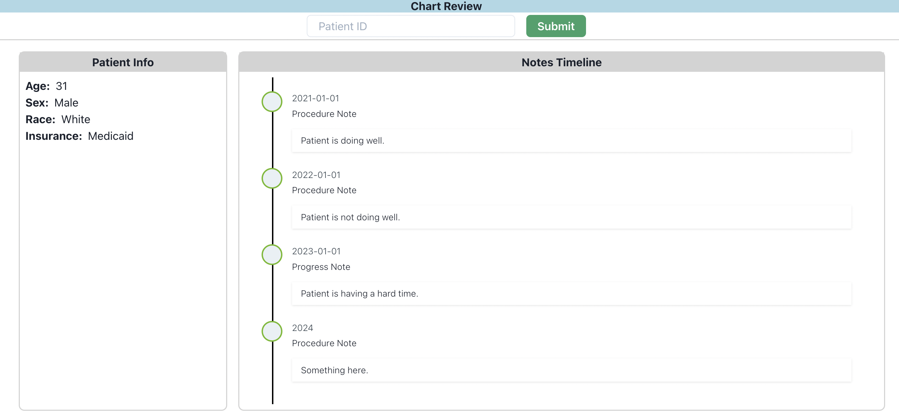

# FEMR Chart Review UI

Browser-based chart review UI for reviewing patient timelines from FEMR. Written in [Pynecone](https://pynecone.io/)



## Installation

```bash
git clone https://github.com/som-shahlab/femr-chart-review-tool.gi
cd femr-chart-review-tool
pip3 install -r requirements.txt
```

## Quickstart

```bash
pc run --loglevel debug
```